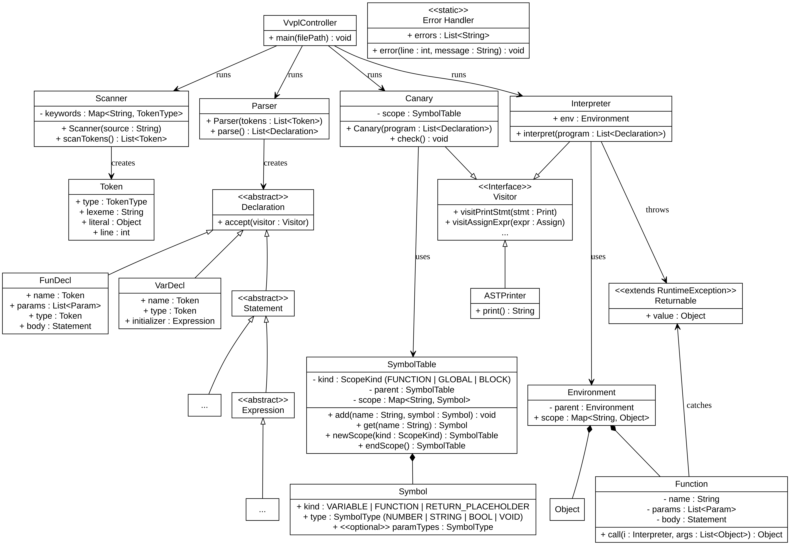

# Interpreter (Java/Maven)

A custom tree-walk interpreter that processes a strictly-typed scripting language. I

## Quick Description
1.  **Scanner & Parser:** Converts source code into an Abstract Syntax Tree using a recursive-descent approach.
2.  **Semantic Analyzer (Canary):** A pre-execution pass that validates types, checks function purity, and enforces scoping rules.
3.  **Interpreter:** Executes the validated AST using the **Visitor Pattern**.

### Architecture


## Language Rules
The language is designed to prevent common logical bugs by being "stricter" than standard languages:

* **Isolated Functions:** Functions only have access to their own parameters and local variables. They cannot reach into the global scope.
* **No Shadowing:** To keep code readable, you cannot re-declare a variable name if it already exists in a parent block.
* **Strict Typing:** Explicit types (`Number`, `String`, `Bool`) are required. Variables must be initialized immediately upon declaration.
* **Safe Returns:** The analyzer ensures a function returns the correct type on every possible execution path.

## Quality Assurance
The project includes an **extensive test suite** covering:
* Positive cases (valid scripts).
* Negative cases (catching syntax, type, and scoping errors at compile-time).
* Complex recursion (e.g., Fibonacci) and nested control flow.

## Usage
Build the project and run the shell script wrapper to execute your files:

```bash
mvn clean install

./vvpl.sh <path_to_file>
```